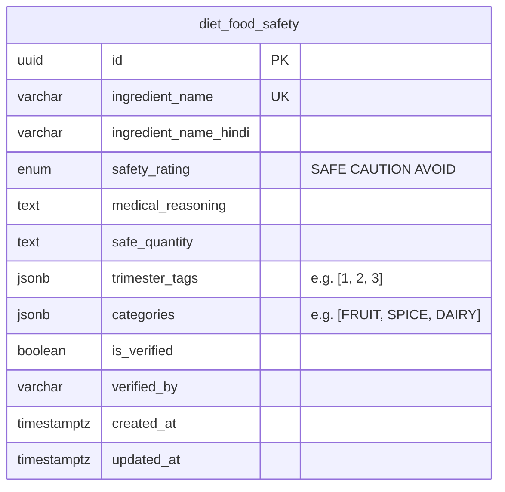

# Reejuven8 & NineMo — Database Design Document

> **Version:** 1.0  
> **Date:** 2026-06-10  
> **Status:** DRAFT — Pending Approval  
> **Strategy:** Polyglot Persistence (PostgreSQL + MongoDB + Redis + AWS S3)

---

## Table of Contents

1. [Design Philosophy](#1-design-philosophy)
2. [SQL vs NoSQL Decision Framework](#2-sql-vs-nosql-decision-framework)
3. [Entity Inventory & Placement Analysis](#3-entity-inventory--placement-analysis)
4. [Entity-Relationship Diagrams](#4-entity-relationship-diagrams)
5. [PostgreSQL Schema — Complete Definitions](#5-postgresql-schema--complete-definitions)
6. [MongoDB Schema — Complete Definitions](#6-mongodb-schema--complete-definitions)
7. [Redis Cache Schema](#7-redis-cache-schema)
8. [AWS S3 Object Storage Strategy](#8-aws-s3-object-storage-strategy)
9. [Cross-Database Referencing Strategy](#9-cross-database-referencing-strategy)
10. [Indexing Strategy](#10-indexing-strategy)
11. [Data Migration & Versioning](#11-data-migration--versioning)
12. [Data Lifecycle & Retention](#12-data-lifecycle--retention)

---

## 1. Design Philosophy

### 1.1 The Core Problem

Healthcare data is inherently **chaotic and heterogeneous**. On one side, we have legally binding, strictly structured data — user identities, government ABHA addresses, consent artifacts, and financial transactions. On the other side, we have wildly varying clinical data — FHIR JSON bundles of arbitrary depth, scanned lab reports in dozens of formats, symptom logs with variable field sets, and real-time chat messages.

A monolithic, single-database approach **will fail** because:

- **A rigid SQL schema cannot model FHIR data.** FHIR resources (Observations, MedicationRequests, DiagnosticReports) are deeply nested JSON objects with polymorphic structures. Mapping them into normalized relational tables creates an explosion of joins and breaks the FHIR standard's native JSON format.
- **A flexible NoSQL schema cannot enforce data integrity.** User identity, ABHA addresses, consent status, and appointment booking require strict ACID guarantees. A `BOOKED` appointment must never become a phantom record. A consent that was `REVOKED` must never appear as `GRANTED` due to eventual consistency.

### 1.2 The Solution: Polyglot Persistence

We split our data layer into **four specialized stores**, each handling the type of data it was purpose-built for:

| Store | Role | Analogy |
|---|---|---|
| **PostgreSQL 16** | The legal ledger — strict identity, relationships, transactions | The government registry |
| **MongoDB 7** | The medical filing cabinet — flexible, nested clinical documents | The doctor's notes binder |
| **Redis 7** | The sticky note — ephemeral state, caches, real-time counters | The receptionist's notepad |
| **AWS S3** | The vault — encrypted physical files (PDFs, images, signatures) | The locked filing cabinet |

### 1.3 Guiding Principles

1. **Data lives where it belongs.** Don't force relational data into documents, or documents into tables.
2. **Cross-reference by UUID, not foreign keys.** PostgreSQL and MongoDB are linked by shared `user_id` / `patient_id` UUIDs, not database-level foreign key constraints.
3. **Every table/collection has an audit trail.** `created_at` and `updated_at` on every entity.
4. **Immutable audit logs via Kafka.** Legal state changes (consent) are additionally logged to Kafka's immutable append-only log.
5. **One owner per entity.** Each table/collection is owned by exactly one microservice. No shared-write access.

> **Complexity Rating: 3/10** — The philosophy is clear; execution requires discipline.

---

## 2. SQL vs NoSQL Decision Framework

### 2.1 The Decision Matrix

For **every single entity** in the system, we apply the following decision framework:

| Criterion | Favors **PostgreSQL** (SQL) | Favors **MongoDB** (NoSQL) |
|---|---|---|
| **Schema stability** | Schema is fixed and known at design time | Schema varies per record or evolves frequently |
| **Relationship complexity** | Entity has many foreign key relationships | Entity is self-contained / denormalized |
| **Transaction requirements** | Needs multi-row ACID guarantees | Eventual consistency is acceptable |
| **Query pattern** | Complex joins across multiple tables | Single-document reads/writes, aggregation pipelines |
| **Data shape** | Flat, tabular, uniform | Deeply nested, hierarchical, polymorphic |
| **Legal/compliance** | Data has legal significance (identity, consent, billing) | Clinical observations, logs, content |
| **Write pattern** | Infrequent writes, many reads | High write throughput (logs, time-series) |
| **Standards compliance** | Custom internal schema | Must conform to external standard (FHIR R4) |

### 2.2 Applying the Matrix to Our Domain

#### Data That MUST Be in PostgreSQL

| Entity | Key Reason |
|---|---|
| `users` | Legal identity anchor. ABHA address is government-issued; uniqueness is legally mandated. RBAC role determines app behavior. |
| `patient_profiles` | Strict 1:1 FK relationship to `users`. Date of birth drives clinical calculations. |
| `doctor_profiles` | Medical license number has legal compliance requirements for e-prescriptions. |
| `addresses` | 1:N FK relationship. Pincode is used for geolocation doctor search (SQL range queries). |
| `pregnancy_profiles` | 1:N FK relationship with state machine logic (`is_active`, `delivery_date`). EDD date drives entire timeline. |
| `child_profiles` | 1:1 FK to `pregnancy_profiles`. Birth metrics are fixed at creation. |
| `appointments` | Transactional booking engine. Double-booking prevention requires ACID. Status enum is a state machine. |
| `user_consents` | **ABDM legal mandate.** Consent status has time-bound legal enforceability. Must never show stale state. |
| `medication_schedules` | Pill inventory is a counter that requires atomic decrement. Schedule times are structured. |
| `vaccination_records` | 1:N FK to `child_profiles`. IAP schedule is fixed. Status tracking requires consistency. |
| `hospital_bag_items` | 1:N FK to `pregnancy_profiles`. Simple boolean checklist — relational fits perfectly. |
| `diet_food_safety` | Static lookup table. Structured fields (name, rating, trimester tags). Benefits from SQL text search. |
| `notification_logs` | Delivery status tracking with retry counts requires atomic updates. |

#### Data That MUST Be in MongoDB

| Entity | Key Reason |
|---|---|
| `fhir_resources` | **FHIR R4 standard mandates JSON.** Resources like `Observation`, `MedicationRequest`, and `DiagnosticReport` are polymorphic, deeply nested JSON objects. Storing them in SQL would require dozens of tables and destroy the native format. |
| `ninemo_timeline_feed` | Pre-computed denormalized feed documents. Contains mixed arrays of objects (milestones, symptoms, diet tips). One document = one week of content. No joins needed. |
| `symptom_logs` | High-write, append-only time-series data. Variable symptom arrays. Fed into rule engine, not joined with other tables. |
| `vitals_logs` | High-write time-series. Each log has context (gestational week, trimester) that makes it a self-contained document. Used for trend aggregation pipelines. |
| `kick_counter_sessions` | Event-sourced sessions with variable duration. Append-only. Queried by date range, not joined. |
| `contraction_sessions` | Same pattern as kick counter — time-series sessions with computed metrics. |
| `due_date_clubs` | Flexible membership arrays. Channel topics are dynamic. No rigid relational structure. |
| `chat_messages` | Extremely high write throughput. No relational joins. Queried by club + timestamp. |
| `content_articles` | CMS-style content with variable metadata, media types, and tag arrays. Benefits from flexible schema. |
| `developmental_milestones` | Semi-structured checklists that vary by month. Mixed arrays of physical and cognitive items. |

### 2.3 The "Grey Zone" — Entities That Could Go Either Way

| Entity | Our Decision | Rationale |
|---|---|---|
| `weight_logs` | **MongoDB** | Although simple, weight logs are high-write time-series data. They are never joined with other tables. They are queried via aggregation pipelines for trend charts. Grouping them with `vitals_logs` in MongoDB keeps all trend data in one store. |
| `growth_measurements` | **MongoDB** | Child growth data feeds into WHO Z-score aggregation pipelines. It's time-series data queried by age range. Same reasoning as vitals. |
| `medication_schedules` | **PostgreSQL** | Despite being patient-specific, inventory count requires atomic `UPDATE SET count = count - 1`. The schedule triggers time-based background jobs. Relational fits better for transactional counters. |

> **Complexity Rating: 5/10** — Requires careful entity-by-entity analysis, but each decision follows a clear, defensible rationale.

---

## 3. Entity Inventory & Placement Analysis

### 3.1 Complete Entity Map

| # | Entity | Database | Owning Service | Relationship Type | Functional Area |
|---|---|---|---|---|---|
| 1 | `users` | PostgreSQL | `identity-abha-service` | Root entity | Identity & Access |
| 2 | `patient_profiles` | PostgreSQL | `identity-abha-service` | 1:1 → `users` | Identity & Access |
| 3 | `doctor_profiles` | PostgreSQL | `identity-abha-service` | 1:1 → `users` | Identity & Access |
| 4 | `addresses` | PostgreSQL | `identity-abha-service` | N:1 → `users` | Identity & Access |
| 5 | `user_consents` | PostgreSQL | `identity-abha-service` | N:1 → `users` (×2) | ABDM Compliance |
| 6 | `appointments` | PostgreSQL | `identity-abha-service` | N:1 → `users` (×2) | Practice Management |
| 7 | `pregnancy_profiles` | PostgreSQL | `ninemo-clinical-service` | N:1 → `users` | NineMo Antenatal |
| 8 | `child_profiles` | PostgreSQL | `ninemo-clinical-service` | 1:1 → `pregnancy_profiles` | NineMo Postnatal |
| 9 | `vaccination_records` | PostgreSQL | `ninemo-clinical-service` | N:1 → `child_profiles` | NineMo Postnatal |
| 10 | `medication_schedules` | PostgreSQL | `ninemo-clinical-service` | N:1 → `users` | Utilities |
| 11 | `hospital_bag_items` | PostgreSQL | `ninemo-clinical-service` | N:1 → `pregnancy_profiles` | Utilities |
| 12 | `diet_food_safety` | PostgreSQL | `ninemo-clinical-service` | Standalone lookup | Indian Context |
| 13 | `notification_logs` | PostgreSQL | `notification-service` | N:1 → `users` | Communication |
| 14 | `fhir_resources` | MongoDB | `health-data-service` | References `users.id` | Clinical Data Lake |
| 15 | `ninemo_timeline_feed` | MongoDB | `ninemo-clinical-service` | References `pregnancy_profiles.id` | NineMo Timeline |
| 16 | `symptom_logs` | MongoDB | `ninemo-clinical-service` | References `users.id` | NineMo Triage |
| 17 | `vitals_logs` | MongoDB | `ninemo-clinical-service` | References `users.id` | NineMo Monitoring |
| 18 | `kick_counter_sessions` | MongoDB | `ninemo-clinical-service` | References `users.id` | NineMo High-Risk |
| 19 | `contraction_sessions` | MongoDB | `ninemo-clinical-service` | References `users.id` | NineMo High-Risk |
| 20 | `growth_measurements` | MongoDB | `ninemo-clinical-service` | References `child_profiles.id` | NineMo Pediatric |
| 21 | `developmental_milestones` | MongoDB | `ninemo-clinical-service` | References `child_profiles.id` | NineMo Pediatric |
| 22 | `due_date_clubs` | MongoDB | `ninemo-community-service` | References `users.id` (array) | Community |
| 23 | `chat_messages` | MongoDB | `ninemo-community-service` | References `due_date_clubs._id` | Community |
| 24 | `content_articles` | MongoDB | `ninemo-community-service` | Standalone | Content Delivery |

**Total: 24 entities** — 13 in PostgreSQL, 11 in MongoDB.

### 3.2 Summary By Functional Area

```
┌─────────────────────────────────────────────────────────────────────┐
│                    POSTGRESQL (13 Tables)                            │
│                                                                     │
│  ┌─────────────────────────┐  ┌─────────────────────────────────┐  │
│  │  Identity & Access (6)  │  │  NineMo Domain (5)              │  │
│  │  • users                │  │  • pregnancy_profiles            │  │
│  │  • patient_profiles     │  │  • child_profiles                │  │
│  │  • doctor_profiles      │  │  • vaccination_records           │  │
│  │  • addresses            │  │  • medication_schedules          │  │
│  │  • user_consents        │  │  • hospital_bag_items            │  │
│  │  • appointments         │  │                                  │  │
│  └─────────────────────────┘  └─────────────────────────────────┘  │
│                                                                     │
│  ┌─────────────────────────┐  ┌─────────────────────────────────┐  │
│  │  Lookup (1)             │  │  System (1)                     │  │
│  │  • diet_food_safety     │  │  • notification_logs            │  │
│  └─────────────────────────┘  └─────────────────────────────────┘  │
└─────────────────────────────────────────────────────────────────────┘

┌─────────────────────────────────────────────────────────────────────┐
│                    MONGODB (11 Collections)                          │
│                                                                     │
│  ┌─────────────────────────┐  ┌─────────────────────────────────┐  │
│  │  Clinical Data (1)      │  │  NineMo Time-Series (6)         │  │
│  │  • fhir_resources       │  │  • ninemo_timeline_feed          │  │
│  │                         │  │  • symptom_logs                  │  │
│  │                         │  │  • vitals_logs                   │  │
│  │                         │  │  • kick_counter_sessions         │  │
│  │                         │  │  • contraction_sessions          │  │
│  │                         │  │  • growth_measurements           │  │
│  └─────────────────────────┘  └─────────────────────────────────┘  │
│                                                                     │
│  ┌─────────────────────────┐  ┌─────────────────────────────────┐  │
│  │  Community (2)          │  │  Content & Milestones (2)       │  │
│  │  • due_date_clubs       │  │  • content_articles              │  │
│  │  • chat_messages        │  │  • developmental_milestones      │  │
│  └─────────────────────────┘  └─────────────────────────────────┘  │
└─────────────────────────────────────────────────────────────────────┘
```

> **Complexity Rating: 4/10** — Clear enumeration; the challenge is maintaining discipline during implementation.

---

## 4. Entity-Relationship Diagrams

### 4.1 PostgreSQL ER Diagram — Identity & Access Domain

```mermaid
erDiagram
    users ||--o| patient_profiles : "has"
    users ||--o| doctor_profiles : "has"
    users ||--o{ addresses : "lives at"
    users ||--o{ user_consents : "grants consent as patient"
    users ||--o{ user_consents : "receives consent as doctor"
    users ||--o{ appointments : "books as patient"
    users ||--o{ appointments : "attends as doctor"
    users ||--o{ notification_logs : "receives"

    users {
        uuid id PK
        varchar first_name
        varchar middle_name
        varchar last_name
        varchar abha_address UK
        varchar phone_number UK
        varchar email_id UK
        varchar password_hash
        enum role "PATIENT DOCTOR ADMIN"
        varchar profile_picture_url
        boolean is_active
        timestamptz created_at
        timestamptz updated_at
    }

    patient_profiles {
        uuid id PK
        uuid user_id FK_UK
        date date_of_birth
        enum biological_sex "MALE FEMALE OTHER"
        varchar emergency_contact_name
        varchar emergency_contact_number
        timestamptz created_at
        timestamptz updated_at
    }

    doctor_profiles {
        uuid id PK
        uuid user_id FK_UK
        varchar medical_license_number UK
        varchar specialization
        varchar qualifications
        integer years_of_experience
        decimal consultation_fee
        text bio
        varchar digital_signature_url
        boolean is_accepting_patients
        timestamptz created_at
        timestamptz updated_at
    }

    addresses {
        uuid id PK
        uuid user_id FK
        enum address_type "HOME CLINIC BILLING"
        varchar address_line_1
        varchar address_line_2
        varchar city
        varchar state
        varchar pincode
        varchar country
        timestamptz created_at
        timestamptz updated_at
    }

    user_consents {
        uuid id PK
        uuid patient_id FK
        uuid doctor_id FK
        enum consent_status "GRANTED REVOKED EXPIRED"
        varchar abdm_consent_id
        timestamptz granted_at
        timestamptz expires_at
        timestamptz revoked_at
        timestamptz created_at
        timestamptz updated_at
    }

    appointments {
        uuid id PK
        uuid patient_id FK
        uuid doctor_id FK
        enum appointment_type "ONLINE WALKIN TELEHEALTH"
        timestamptz scheduled_time
        integer duration_minutes
        enum status "BOOKED CONFIRMED IN_PROGRESS COMPLETED CANCELLED NO_SHOW"
        text notes
        timestamptz created_at
        timestamptz updated_at
    }

    notification_logs {
        uuid id PK
        uuid user_id FK
        enum channel "WHATSAPP SMS PUSH EMAIL"
        varchar event_type
        enum status "PENDING SENT DELIVERED FAILED"
        text message_body
        integer retry_count
        varchar external_message_id
        text failure_reason
        timestamptz sent_at
        timestamptz delivered_at
        timestamptz created_at
    }
```

### 4.2 PostgreSQL ER Diagram — NineMo Domain

```mermaid
erDiagram
    users ||--o{ pregnancy_profiles : "has pregnancies"
    pregnancy_profiles ||--o| child_profiles : "results in"
    pregnancy_profiles ||--o{ hospital_bag_items : "prepares"
    child_profiles ||--o{ vaccination_records : "receives"
    users ||--o{ medication_schedules : "takes"

    pregnancy_profiles {
        uuid id PK
        uuid user_id FK
        date lmp_date
        date ultrasound_date
        date ivf_transfer_date
        date edd_date
        enum edd_calculation_method "LMP ULTRASOUND IVF"
        decimal height_cm
        decimal pre_pregnancy_weight_kg
        decimal baseline_bmi
        varchar blood_group
        jsonb high_risk_flags
        boolean is_active
        date delivery_date
        enum delivery_type "NORMAL CAESAREAN ASSISTED"
        timestamptz created_at
        timestamptz updated_at
    }

    child_profiles {
        uuid id PK
        uuid pregnancy_profile_id FK_UK
        uuid parent_user_id FK
        varchar child_name
        date date_of_birth
        decimal birth_weight_kg
        decimal birth_height_cm
        decimal head_circumference_cm
        enum biological_sex "MALE FEMALE"
        varchar blood_group
        boolean is_active
        timestamptz created_at
        timestamptz updated_at
    }

    vaccination_records {
        uuid id PK
        uuid child_id FK
        varchar vaccine_name
        varchar vaccine_code
        integer dose_number
        date scheduled_date
        date administered_date
        enum status "PENDING COMPLETED SKIPPED OVERDUE"
        varchar certificate_s3_url
        varchar administered_by
        text notes
        timestamptz created_at
        timestamptz updated_at
    }

    medication_schedules {
        uuid id PK
        uuid user_id FK
        uuid pregnancy_profile_id FK
        varchar medication_name
        varchar dosage
        varchar dosage_instructions
        enum schedule_time "MORNING BEFORE_LUNCH AFTER_LUNCH EVENING BEDTIME"
        time reminder_time
        boolean is_active
        integer current_inventory_count
        integer refill_threshold
        date start_date
        date end_date
        timestamptz created_at
        timestamptz updated_at
    }

    hospital_bag_items {
        uuid id PK
        uuid pregnancy_profile_id FK
        varchar item_name
        enum category "DOCUMENTS MOTHER BABY PARTNER SNACKS OTHER"
        boolean is_packed
        boolean is_custom_item
        integer sort_order
        timestamptz created_at
        timestamptz updated_at
    }
```

### 4.3 PostgreSQL ER Diagram — Lookup Tables



### 4.4 MongoDB Document Relationship Map

Since MongoDB has no foreign keys, relationships are expressed via **embedded UUID references** and **denormalized data**:

```
                        ┌──────────────────────┐
                        │  PostgreSQL users.id  │
                        │  (Source of Truth)     │
                        └──────────┬───────────┘
                                   │
               ┌───────────────────┼───────────────────┐
               │                   │                   │
               ▼                   ▼                   ▼
    ┌──────────────────┐ ┌─────────────────┐ ┌────────────────────┐
    │  fhir_resources   │ │  symptom_logs   │ │  vitals_logs       │
    │  .patient_id      │ │  .patient_id    │ │  .patient_id       │
    └──────────────────┘ └─────────────────┘ └────────────────────┘
               │
               │ (also references)
               ▼
    ┌──────────────────────────────┐
    │  PostgreSQL                   │
    │  pregnancy_profiles.id        │
    └──────────────┬───────────────┘
                   │
       ┌───────────┼────────────┐
       ▼           ▼            ▼
┌────────────┐┌──────────┐┌───────────────┐
│ ninemo_    ││ kick_    ││ contraction_  │
│ timeline_  ││ counter_ ││ sessions      │
│ feed       ││ sessions ││               │
│ .pregnancy_││          ││               │
│  profile_id││          ││               │
└────────────┘└──────────┘└───────────────┘

    ┌──────────────────────────────┐
    │  PostgreSQL                   │
    │  child_profiles.id            │
    └──────────────┬───────────────┘
                   │
       ┌───────────┼────────────┐
       ▼           ▼            ▼
┌────────────┐┌──────────────────┐
│ growth_    ││ developmental_  │
│ measure-   ││ milestones      │
│ ments      ││                 │
│ .child_id  ││ .child_id       │
└────────────┘└──────────────────┘
```

> **Complexity Rating: 6/10** — ER modeling across two databases requires explicit reference conventions and careful documentation.

---

## 5. PostgreSQL Schema — Complete Definitions

### 5.1 Enums (Shared Types)

```sql
-- Identity & Access
CREATE TYPE user_role AS ENUM ('PATIENT', 'DOCTOR', 'ADMIN');
CREATE TYPE biological_sex AS ENUM ('MALE', 'FEMALE', 'OTHER');
CREATE TYPE address_type AS ENUM ('HOME', 'CLINIC', 'BILLING');
CREATE TYPE consent_status AS ENUM ('GRANTED', 'REVOKED', 'EXPIRED');

-- Practice Management
CREATE TYPE appointment_type AS ENUM ('ONLINE', 'WALKIN', 'TELEHEALTH');
CREATE TYPE appointment_status AS ENUM ('BOOKED', 'CONFIRMED', 'IN_PROGRESS', 'COMPLETED', 'CANCELLED', 'NO_SHOW');

-- NineMo
CREATE TYPE edd_calculation_method AS ENUM ('LMP', 'ULTRASOUND', 'IVF');
CREATE TYPE delivery_type AS ENUM ('NORMAL', 'CAESAREAN', 'ASSISTED');
CREATE TYPE vaccination_status AS ENUM ('PENDING', 'COMPLETED', 'SKIPPED', 'OVERDUE');
CREATE TYPE medication_schedule_time AS ENUM ('MORNING', 'BEFORE_LUNCH', 'AFTER_LUNCH', 'EVENING', 'BEDTIME');
CREATE TYPE bag_item_category AS ENUM ('DOCUMENTS', 'MOTHER', 'BABY', 'PARTNER', 'SNACKS', 'OTHER');

-- Lookup
CREATE TYPE food_safety_rating AS ENUM ('SAFE', 'CAUTION', 'AVOID');

-- Notifications
CREATE TYPE notification_channel AS ENUM ('WHATSAPP', 'SMS', 'PUSH', 'EMAIL');
CREATE TYPE notification_status AS ENUM ('PENDING', 'SENT', 'DELIVERED', 'FAILED');
```

### 5.2 Table: `users`

```sql
CREATE TABLE users (
    id                  UUID PRIMARY KEY DEFAULT gen_random_uuid(),
    first_name          VARCHAR(100) NOT NULL,
    middle_name         VARCHAR(100),
    last_name           VARCHAR(100) NOT NULL,
    abha_address        VARCHAR(255) UNIQUE,           -- e.g., patient@abdm
    phone_number        VARCHAR(15)  UNIQUE NOT NULL,   -- primary OTP channel
    email_id            VARCHAR(255) UNIQUE,
    password_hash       VARCHAR(255),                   -- bcrypt, for non-ABHA auth
    role                user_role    NOT NULL,
    profile_picture_url VARCHAR(500),                   -- S3 presigned URL
    is_active           BOOLEAN      NOT NULL DEFAULT TRUE,
    created_at          TIMESTAMPTZ  NOT NULL DEFAULT NOW(),
    updated_at          TIMESTAMPTZ  NOT NULL DEFAULT NOW()
);

-- Trigger for auto-updating updated_at
CREATE OR REPLACE FUNCTION update_updated_at_column()
RETURNS TRIGGER AS $$
BEGIN
    NEW.updated_at = NOW();
    RETURN NEW;
END;
$$ language 'plpgsql';

CREATE TRIGGER update_users_updated_at
    BEFORE UPDATE ON users
    FOR EACH ROW EXECUTE FUNCTION update_updated_at_column();
```

### 5.3 Table: `patient_profiles`

```sql
CREATE TABLE patient_profiles (
    id                       UUID PRIMARY KEY DEFAULT gen_random_uuid(),
    user_id                  UUID UNIQUE NOT NULL REFERENCES users(id) ON DELETE CASCADE,
    date_of_birth            DATE NOT NULL,
    biological_sex           biological_sex NOT NULL,
    emergency_contact_name   VARCHAR(200),
    emergency_contact_number VARCHAR(15),
    created_at               TIMESTAMPTZ NOT NULL DEFAULT NOW(),
    updated_at               TIMESTAMPTZ NOT NULL DEFAULT NOW()
);

CREATE TRIGGER update_patient_profiles_updated_at
    BEFORE UPDATE ON patient_profiles
    FOR EACH ROW EXECUTE FUNCTION update_updated_at_column();
```

### 5.4 Table: `doctor_profiles`

```sql
CREATE TABLE doctor_profiles (
    id                     UUID PRIMARY KEY DEFAULT gen_random_uuid(),
    user_id                UUID UNIQUE NOT NULL REFERENCES users(id) ON DELETE CASCADE,
    medical_license_number VARCHAR(50) UNIQUE NOT NULL,
    specialization         VARCHAR(100) NOT NULL,
    qualifications         VARCHAR(200) NOT NULL,
    years_of_experience    INTEGER,
    consultation_fee       DECIMAL(10,2) NOT NULL DEFAULT 0.00,
    bio                    TEXT,
    digital_signature_url  VARCHAR(500),         -- S3 URL; legally required for e-Rx
    is_accepting_patients  BOOLEAN NOT NULL DEFAULT TRUE,
    created_at             TIMESTAMPTZ NOT NULL DEFAULT NOW(),
    updated_at             TIMESTAMPTZ NOT NULL DEFAULT NOW()
);

CREATE TRIGGER update_doctor_profiles_updated_at
    BEFORE UPDATE ON doctor_profiles
    FOR EACH ROW EXECUTE FUNCTION update_updated_at_column();
```

### 5.5 Table: `addresses`

```sql
CREATE TABLE addresses (
    id             UUID PRIMARY KEY DEFAULT gen_random_uuid(),
    user_id        UUID NOT NULL REFERENCES users(id) ON DELETE CASCADE,
    address_type   address_type NOT NULL,
    address_line_1 VARCHAR(255) NOT NULL,
    address_line_2 VARCHAR(255),
    city           VARCHAR(100) NOT NULL,
    state          VARCHAR(100) NOT NULL,
    pincode        VARCHAR(10)  NOT NULL,    -- essential for geo-search
    country        VARCHAR(100) NOT NULL DEFAULT 'India',
    created_at     TIMESTAMPTZ  NOT NULL DEFAULT NOW(),
    updated_at     TIMESTAMPTZ  NOT NULL DEFAULT NOW()
);

CREATE TRIGGER update_addresses_updated_at
    BEFORE UPDATE ON addresses
    FOR EACH ROW EXECUTE FUNCTION update_updated_at_column();
```

### 5.6 Table: `user_consents`

```sql
CREATE TABLE user_consents (
    id               UUID PRIMARY KEY DEFAULT gen_random_uuid(),
    patient_id       UUID NOT NULL REFERENCES users(id) ON DELETE CASCADE,
    doctor_id        UUID NOT NULL REFERENCES users(id) ON DELETE CASCADE,
    consent_status   consent_status NOT NULL,
    abdm_consent_id  VARCHAR(255),           -- government consent artifact ID
    granted_at       TIMESTAMPTZ NOT NULL,
    expires_at       TIMESTAMPTZ NOT NULL,    -- ABDM consents are time-bound
    revoked_at       TIMESTAMPTZ,
    created_at       TIMESTAMPTZ NOT NULL DEFAULT NOW(),
    updated_at       TIMESTAMPTZ NOT NULL DEFAULT NOW(),

    CONSTRAINT chk_consent_dates CHECK (expires_at > granted_at)
);

CREATE TRIGGER update_user_consents_updated_at
    BEFORE UPDATE ON user_consents
    FOR EACH ROW EXECUTE FUNCTION update_updated_at_column();
```

### 5.7 Table: `appointments`

```sql
CREATE TABLE appointments (
    id                UUID PRIMARY KEY DEFAULT gen_random_uuid(),
    patient_id        UUID NOT NULL REFERENCES users(id) ON DELETE CASCADE,
    doctor_id         UUID NOT NULL REFERENCES users(id) ON DELETE CASCADE,
    appointment_type  appointment_type NOT NULL,
    scheduled_time    TIMESTAMPTZ NOT NULL,
    duration_minutes  INTEGER NOT NULL DEFAULT 30,
    status            appointment_status NOT NULL DEFAULT 'BOOKED',
    cancellation_reason TEXT,
    notes             TEXT,
    created_at        TIMESTAMPTZ NOT NULL DEFAULT NOW(),
    updated_at        TIMESTAMPTZ NOT NULL DEFAULT NOW()
);

CREATE TRIGGER update_appointments_updated_at
    BEFORE UPDATE ON appointments
    FOR EACH ROW EXECUTE FUNCTION update_updated_at_column();
```

### 5.8 Table: `pregnancy_profiles`

```sql
CREATE TABLE pregnancy_profiles (
    id                      UUID PRIMARY KEY DEFAULT gen_random_uuid(),
    user_id                 UUID NOT NULL REFERENCES users(id) ON DELETE CASCADE,
    lmp_date                DATE,
    ultrasound_date         DATE,
    ivf_transfer_date       DATE,
    edd_date                DATE NOT NULL,
    edd_calculation_method  edd_calculation_method NOT NULL,
    height_cm               DECIMAL(5,2) NOT NULL,
    pre_pregnancy_weight_kg DECIMAL(5,2) NOT NULL,
    baseline_bmi            DECIMAL(4,1) NOT NULL,
    blood_group             VARCHAR(5)   NOT NULL,      -- e.g., "A+", "O-"
    high_risk_flags         JSONB,                      -- ["PCOS", "Hypothyroidism"]
    is_active               BOOLEAN NOT NULL DEFAULT TRUE,
    delivery_date           DATE,                       -- triggers mode transition
    delivery_type           delivery_type,
    created_at              TIMESTAMPTZ NOT NULL DEFAULT NOW(),
    updated_at              TIMESTAMPTZ NOT NULL DEFAULT NOW(),

    CONSTRAINT chk_at_least_one_date CHECK (
        lmp_date IS NOT NULL OR ultrasound_date IS NOT NULL OR ivf_transfer_date IS NOT NULL
    )
);

CREATE TRIGGER update_pregnancy_profiles_updated_at
    BEFORE UPDATE ON pregnancy_profiles
    FOR EACH ROW EXECUTE FUNCTION update_updated_at_column();
```

### 5.9 Table: `child_profiles`

```sql
CREATE TABLE child_profiles (
    id                    UUID PRIMARY KEY DEFAULT gen_random_uuid(),
    pregnancy_profile_id  UUID UNIQUE NOT NULL REFERENCES pregnancy_profiles(id) ON DELETE CASCADE,
    parent_user_id        UUID NOT NULL REFERENCES users(id) ON DELETE CASCADE,
    child_name            VARCHAR(200),
    date_of_birth         DATE NOT NULL,
    birth_weight_kg       DECIMAL(4,2),
    birth_height_cm       DECIMAL(5,2),
    head_circumference_cm DECIMAL(5,2),
    biological_sex        biological_sex NOT NULL,
    blood_group           VARCHAR(5),
    is_active             BOOLEAN NOT NULL DEFAULT TRUE,
    created_at            TIMESTAMPTZ NOT NULL DEFAULT NOW(),
    updated_at            TIMESTAMPTZ NOT NULL DEFAULT NOW()
);

CREATE TRIGGER update_child_profiles_updated_at
    BEFORE UPDATE ON child_profiles
    FOR EACH ROW EXECUTE FUNCTION update_updated_at_column();
```

### 5.10 Table: `vaccination_records`

```sql
CREATE TABLE vaccination_records (
    id                UUID PRIMARY KEY DEFAULT gen_random_uuid(),
    child_id          UUID NOT NULL REFERENCES child_profiles(id) ON DELETE CASCADE,
    vaccine_name      VARCHAR(100) NOT NULL,     -- e.g., "BCG", "OPV", "Hepatitis B"
    vaccine_code      VARCHAR(20),               -- standard code if available
    dose_number       INTEGER NOT NULL DEFAULT 1,
    scheduled_date    DATE NOT NULL,              -- auto-calculated from birth date + IAP schedule
    administered_date DATE,
    status            vaccination_status NOT NULL DEFAULT 'PENDING',
    certificate_s3_url VARCHAR(500),             -- uploaded vaccination chart photo
    administered_by    VARCHAR(200),              -- doctor/clinic name
    notes              TEXT,
    created_at         TIMESTAMPTZ NOT NULL DEFAULT NOW(),
    updated_at         TIMESTAMPTZ NOT NULL DEFAULT NOW(),

    UNIQUE (child_id, vaccine_name, dose_number)
);

CREATE TRIGGER update_vaccination_records_updated_at
    BEFORE UPDATE ON vaccination_records
    FOR EACH ROW EXECUTE FUNCTION update_updated_at_column();
```

### 5.11 Table: `medication_schedules`

```sql
CREATE TABLE medication_schedules (
    id                      UUID PRIMARY KEY DEFAULT gen_random_uuid(),
    user_id                 UUID NOT NULL REFERENCES users(id) ON DELETE CASCADE,
    pregnancy_profile_id    UUID REFERENCES pregnancy_profiles(id) ON DELETE SET NULL,
    medication_name         VARCHAR(200) NOT NULL,
    dosage                  VARCHAR(100) NOT NULL,  -- e.g., "500mg"
    dosage_instructions     TEXT,                    -- e.g., "Take with food"
    schedule_time           medication_schedule_time NOT NULL,
    reminder_time           TIME,                    -- exact time for push notification
    is_active               BOOLEAN NOT NULL DEFAULT TRUE,
    current_inventory_count INTEGER NOT NULL DEFAULT 0,
    refill_threshold        INTEGER NOT NULL DEFAULT 5,  -- alert when count <= this
    start_date              DATE NOT NULL,
    end_date                DATE,
    created_at              TIMESTAMPTZ NOT NULL DEFAULT NOW(),
    updated_at              TIMESTAMPTZ NOT NULL DEFAULT NOW()
);

CREATE TRIGGER update_medication_schedules_updated_at
    BEFORE UPDATE ON medication_schedules
    FOR EACH ROW EXECUTE FUNCTION update_updated_at_column();
```

### 5.12 Table: `hospital_bag_items`

```sql
CREATE TABLE hospital_bag_items (
    id                   UUID PRIMARY KEY DEFAULT gen_random_uuid(),
    pregnancy_profile_id UUID NOT NULL REFERENCES pregnancy_profiles(id) ON DELETE CASCADE,
    item_name            VARCHAR(200) NOT NULL,
    category             bag_item_category NOT NULL DEFAULT 'OTHER',
    is_packed            BOOLEAN NOT NULL DEFAULT FALSE,
    is_custom_item       BOOLEAN NOT NULL DEFAULT FALSE,  -- pre-set vs user-added
    sort_order           INTEGER NOT NULL DEFAULT 0,
    created_at           TIMESTAMPTZ NOT NULL DEFAULT NOW(),
    updated_at           TIMESTAMPTZ NOT NULL DEFAULT NOW()
);

CREATE TRIGGER update_hospital_bag_items_updated_at
    BEFORE UPDATE ON hospital_bag_items
    FOR EACH ROW EXECUTE FUNCTION update_updated_at_column();
```

### 5.13 Table: `diet_food_safety`

```sql
CREATE TABLE diet_food_safety (
    id                   UUID PRIMARY KEY DEFAULT gen_random_uuid(),
    ingredient_name      VARCHAR(200) UNIQUE NOT NULL,
    ingredient_name_hindi VARCHAR(200),
    safety_rating        food_safety_rating NOT NULL,
    medical_reasoning    TEXT NOT NULL,
    safe_quantity        TEXT,                            -- e.g., "Small amounts ok"
    trimester_tags       JSONB NOT NULL DEFAULT '[1,2,3]', -- which trimesters this applies to
    categories           JSONB,                           -- ["FRUIT","SPICE","DAIRY","HERB"]
    is_verified          BOOLEAN NOT NULL DEFAULT FALSE,
    verified_by          VARCHAR(200),                    -- medical professional name
    created_at           TIMESTAMPTZ NOT NULL DEFAULT NOW(),
    updated_at           TIMESTAMPTZ NOT NULL DEFAULT NOW()
);

CREATE TRIGGER update_diet_food_safety_updated_at
    BEFORE UPDATE ON diet_food_safety
    FOR EACH ROW EXECUTE FUNCTION update_updated_at_column();
```

### 5.14 Table: `notification_logs`

```sql
CREATE TABLE notification_logs (
    id                  UUID PRIMARY KEY DEFAULT gen_random_uuid(),
    user_id             UUID NOT NULL REFERENCES users(id) ON DELETE CASCADE,
    channel             notification_channel NOT NULL,
    event_type          VARCHAR(100) NOT NULL,  -- e.g., "clinical.risk.detected"
    status              notification_status NOT NULL DEFAULT 'PENDING',
    title               VARCHAR(500),
    message_body        TEXT NOT NULL,
    metadata            JSONB,                  -- { gestational_week, risk_type, etc. }
    retry_count         INTEGER NOT NULL DEFAULT 0,
    max_retries         INTEGER NOT NULL DEFAULT 4,
    external_message_id VARCHAR(255),           -- Twilio/Gupshup message SID
    failure_reason      TEXT,
    sent_at             TIMESTAMPTZ,
    delivered_at        TIMESTAMPTZ,
    created_at          TIMESTAMPTZ NOT NULL DEFAULT NOW()
);
```

> **Complexity Rating: 5/10** — Standard relational modeling with medical domain nuances.

---

## 6. MongoDB Schema — Complete Definitions

### 6.1 Collection: `fhir_resources`

```json
{
  "_id": "ObjectId",
  "patient_id": "UUID (→ users.id)",
  "resource_type": "Observation | DiagnosticReport | MedicationRequest | DocumentReference | Encounter",
  "resource_id": "FHIR-assigned UUID",
  "status": "final | preliminary | amended",
  "effective_datetime": "ISODate",
  "category": "laboratory | vital-signs | imaging | procedure",
  "code": {
    "coding": [
      {
        "system": "http://loinc.org",
        "code": "718-7",
        "display": "Hemoglobin [Mass/volume] in Blood"
      }
    ],
    "text": "Hemoglobin"
  },
  "value_quantity": {
    "value": 11.2,
    "unit": "g/dL",
    "system": "http://unitsofmeasure.org",
    "code": "g/dL"
  },
  "interpretation": {
    "coding": [{ "code": "N", "display": "Normal" }]
  },
  "reference_range": {
    "low": { "value": 11.0, "unit": "g/dL" },
    "high": { "value": 16.0, "unit": "g/dL" },
    "text": "Pregnancy-adjusted normal range"
  },
  "source": "ABDM | MANUAL_UPLOAD | OCR_PARSED | LAB_BRIDGE",
  "source_file_s3_url": "s3://reejuven8-health/patient_uuid/file_uuid.pdf",
  "parsing_metadata": {
    "parsed_by": "ai-parsing-service",
    "confidence_score": 0.92,
    "parsed_at": "ISODate",
    "raw_text_excerpt": "Hemoglobin: 11.2 g/dL"
  },
  "tags": ["pregnancy", "trimester-2", "blood-test", "anemia-screen"],
  "notes": "Doctor's annotation if any",
  "raw_fhir_json": { /* Full HAPI FHIR R4 serialized resource */ },
  "created_at": "ISODate",
  "updated_at": "ISODate"
}
```

### 6.2 Collection: `ninemo_timeline_feed`

```json
{
  "_id": "ObjectId",
  "pregnancy_profile_id": "UUID (→ pregnancy_profiles.id)",
  "gestational_week": 24,
  "trimester": 2,
  "baby_development": {
    "size_comparison": "Size of a corn ear (~30 cm)",
    "weight_grams": 600,
    "key_developments": [
      "Lungs are developing branches and surfactant",
      "Baby can hear sounds from outside the womb",
      "Taste buds are forming"
    ],
    "image_url": "s3://reejuven8-content/fetal/week_24.webp"
  },
  "maternal_changes": [
    "You may notice Braxton Hicks contractions",
    "Increased back pain is common this week",
    "Your uterus is now about the size of a soccer ball"
  ],
  "maternal_symptoms_expected": ["back_pain", "heartburn", "leg_cramps", "braxton_hicks"],
  "scheduled_milestones": [
    {
      "name": "Glucose Tolerance Test (GTT)",
      "type": "BLOOD_TEST",
      "recommended_week_range": [24, 28],
      "scheduled_date": "ISODate",
      "status": "PENDING | COMPLETED | SKIPPED",
      "description": "Screens for gestational diabetes",
      "preparation_notes": "Fasting may be required. Check with your doctor."
    }
  ],
  "diet_tips": [
    { "tip": "Increase iron-rich foods like spinach and jaggery", "nutrient_focus": "Iron" },
    { "tip": "Consume 300 extra calories per day", "nutrient_focus": "Calories" }
  ],
  "yoga_routine": {
    "routine_id": "trimester_2_week_24",
    "title": "Gentle Hip Openers",
    "duration_minutes": 20,
    "video_url": "s3://reejuven8-content/yoga/t2_w24.mp4"
  },
  "pinned_reports": ["ObjectId_fhir_1", "ObjectId_fhir_2"],
  "created_at": "ISODate"
}
```

### 6.3 Collection: `symptom_logs`

```json
{
  "_id": "ObjectId",
  "patient_id": "UUID (→ users.id)",
  "pregnancy_profile_id": "UUID (→ pregnancy_profiles.id)",
  "gestational_week_at_log": 34,
  "trimester": 3,
  "symptoms": [
    { "name": "headache", "category": "neurological", "severity": "moderate" },
    { "name": "blurred_vision", "category": "neurological", "severity": "severe" },
    { "name": "swelling_hands", "category": "edema", "severity": "moderate" }
  ],
  "vitals_at_log": {
    "blood_pressure_systolic": 145,
    "blood_pressure_diastolic": 95,
    "weight_kg": 72.5,
    "temperature_celsius": null,
    "heart_rate_bpm": null
  },
  "severity_flag": "CRITICAL | WARNING | NORMAL",
  "triage_result": {
    "rules_triggered": ["PreeclampsiaRule"],
    "recommendation": "CONTACT_DOCTOR_IMMEDIATELY",
    "remediation_tips": [],
    "alert_sent": true,
    "alert_channels": ["WHATSAPP", "PUSH"]
  },
  "logged_at": "ISODate",
  "created_at": "ISODate"
}
```

### 6.4 Collection: `vitals_logs`

```json
{
  "_id": "ObjectId",
  "patient_id": "UUID (→ users.id)",
  "pregnancy_profile_id": "UUID (→ pregnancy_profiles.id)",
  "gestational_week": 28,
  "trimester": 3,
  "vital_type": "WEIGHT | BLOOD_PRESSURE | BLOOD_SUGAR | TEMPERATURE",
  "measurements": {
    "weight_kg": 68.5,
    "blood_pressure_systolic": null,
    "blood_pressure_diastolic": null,
    "fasting_glucose_mg_dl": null,
    "temperature_celsius": null
  },
  "source": "MANUAL | BLUETOOTH_DEVICE | OCR_PARSED",
  "device_name": null,
  "is_within_normal_range": true,
  "alert_triggered": false,
  "logged_at": "ISODate",
  "created_at": "ISODate"
}
```

### 6.5 Collection: `kick_counter_sessions`

```json
{
  "_id": "ObjectId",
  "patient_id": "UUID (→ users.id)",
  "pregnancy_profile_id": "UUID (→ pregnancy_profiles.id)",
  "gestational_week": 32,
  "session_start": "ISODate",
  "session_end": "ISODate",
  "total_kicks": 10,
  "duration_to_10_kicks_minutes": 45,
  "kick_timestamps": ["ISODate", "ISODate", "..."],
  "is_concerning": false,
  "notes": "Baby was very active after lunch",
  "created_at": "ISODate"
}
```

### 6.6 Collection: `contraction_sessions`

```json
{
  "_id": "ObjectId",
  "patient_id": "UUID (→ users.id)",
  "pregnancy_profile_id": "UUID (→ pregnancy_profiles.id)",
  "gestational_week": 38,
  "session_start": "ISODate",
  "session_end": "ISODate",
  "contractions": [
    {
      "start_time": "ISODate",
      "end_time": "ISODate",
      "duration_seconds": 45,
      "intensity": "MILD | MODERATE | STRONG",
      "interval_from_previous_seconds": null
    },
    {
      "start_time": "ISODate",
      "end_time": "ISODate",
      "duration_seconds": 52,
      "intensity": "MODERATE",
      "interval_from_previous_seconds": 480
    }
  ],
  "average_duration_seconds": 48,
  "average_interval_seconds": 480,
  "total_contractions": 8,
  "is_labor_pattern": false,
  "alert_triggered": false,
  "notes": null,
  "created_at": "ISODate"
}
```

### 6.7 Collection: `growth_measurements`

```json
{
  "_id": "ObjectId",
  "child_id": "UUID (→ child_profiles.id)",
  "age_in_months": 6,
  "measurement_date": "ISODate",
  "height_cm": 67.5,
  "weight_kg": 7.8,
  "head_circumference_cm": 43.2,
  "z_scores": {
    "weight_for_age": 0.45,
    "height_for_age": 0.32,
    "weight_for_height": 0.58,
    "head_circumference_for_age": 0.21
  },
  "percentiles": {
    "weight_for_age": 67,
    "height_for_age": 63,
    "weight_for_height": 72,
    "head_circumference_for_age": 58
  },
  "previous_percentiles": {
    "weight_for_age": 72,
    "height_for_age": 68
  },
  "alert_flags": [],
  "crossed_percentile_lines": 0,
  "notes": null,
  "created_at": "ISODate"
}
```

### 6.8 Collection: `developmental_milestones`

```json
{
  "_id": "ObjectId",
  "child_id": "UUID (→ child_profiles.id)",
  "month": 6,
  "category": "PHYSICAL | COGNITIVE | SOCIAL | LANGUAGE",
  "milestones": [
    {
      "name": "Sits without support",
      "description": "Baby can sit upright without propping",
      "status": "ACHIEVED | NOT_YET | SKIPPED",
      "achieved_date": "ISODate | null",
      "expected_by_month": 7,
      "is_critical": true
    },
    {
      "name": "Responds to own name",
      "description": "Baby turns head when name is called",
      "status": "ACHIEVED",
      "achieved_date": "ISODate",
      "expected_by_month": 9,
      "is_critical": true
    }
  ],
  "alert_flags": [],
  "reviewed_at": "ISODate | null",
  "created_at": "ISODate",
  "updated_at": "ISODate"
}
```

### 6.9 Collection: `due_date_clubs`

```json
{
  "_id": "ObjectId",
  "club_name": "March 2026 Moms",
  "due_date_month": "2026-03",
  "members": [
    {
      "user_id": "UUID",
      "alias": "MomBee_42",
      "joined_at": "ISODate"
    }
  ],
  "member_count": 127,
  "channels": [
    {
      "channel_id": "ObjectId",
      "name": "General",
      "description": "General discussion",
      "is_default": true,
      "created_at": "ISODate"
    },
    {
      "channel_id": "ObjectId",
      "name": "C-Section Recovery",
      "description": "Support for C-section recovery",
      "is_default": false,
      "created_at": "ISODate"
    }
  ],
  "is_active": true,
  "created_at": "ISODate"
}
```

### 6.10 Collection: `chat_messages`

```json
{
  "_id": "ObjectId",
  "club_id": "ObjectId (→ due_date_clubs._id)",
  "channel_id": "ObjectId",
  "sender_id": "UUID (→ users.id)",
  "sender_alias": "MomBee_42",
  "message_type": "TEXT | IMAGE | REPLY",
  "message_body": "Has anyone tried the prenatal yoga for back pain?",
  "reply_to_message_id": "ObjectId | null",
  "image_url": "s3://... | null",
  "is_deleted": false,
  "reactions": [
    { "emoji": "❤️", "user_ids": ["UUID", "UUID"] }
  ],
  "sent_at": "ISODate",
  "created_at": "ISODate"
}
```

### 6.11 Collection: `content_articles`

```json
{
  "_id": "ObjectId",
  "title": "Managing Back Pain in the Third Trimester",
  "slug": "managing-back-pain-third-trimester",
  "content_type": "ARTICLE | VIDEO | INFOGRAPHIC",
  "body_markdown": "## Introduction\nBack pain affects...",
  "summary": "Quick tips for managing back pain during late pregnancy",
  "author": "Dr. Priya Sharma, MBBS, MD - OBG",
  "media_url": "s3://reejuven8-content/articles/back_pain_t3.webp",
  "video_url": null,
  "video_duration_seconds": null,
  "target_audience": "PREGNANCY | POSTNATAL | BOTH",
  "target_gestational_weeks": [28, 29, 30, 31, 32, 33, 34, 35, 36, 37, 38, 39, 40],
  "target_postnatal_months": [],
  "tags": ["back_pain", "exercise", "trimester_3", "yoga"],
  "is_verified": true,
  "verified_by": "Dr. Medical Review Board",
  "view_count": 0,
  "is_published": true,
  "published_at": "ISODate",
  "created_at": "ISODate",
  "updated_at": "ISODate"
}
```

> **Complexity Rating: 6/10** — Designing flexible yet query-efficient MongoDB documents requires balancing denormalization with update complexity.

---

## 7. Redis Cache Schema

| Key Pattern | Value Type | TTL | Service | Purpose |
|---|---|---|---|---|
| `abdm:txn:{txnId}` | String (JSON) | 5 min | `identity-abha-service` | ABDM async callback transaction state |
| `abdm:token:access` | String | 29 min | `identity-abha-service` | Cached ABDM Gateway bearer token |
| `auth:session:{userId}` | String (JSON) | 7 days | `identity-abha-service` | Refresh token + session metadata |
| `auth:blacklist:{jti}` | String ("1") | Token TTL | `api-gateway` | Blacklisted JWT IDs (on logout/revoke) |
| `drug:autocomplete:{prefix}` | Sorted Set | 24 hours | `health-data-service` | Drug name autocomplete for e-Rx |
| `gateway:ratelimit:{ip}:{route}` | Counter | 1 min | `api-gateway` | Sliding window rate limit |
| `ninemo:timeline:{profileId}:{week}` | String (JSON) | 1 hour | `ninemo-clinical-service` | Cached rendered timeline feed |
| `ninemo:summary:{patientId}` | String (JSON) | 15 min | `ninemo-clinical-service` | Cached doctor summary card |
| `ws:online:{userId}` | String ("1") | 5 min | `ninemo-community-service` | WebSocket presence tracking |

> **Complexity Rating: 2/10** — Simple key-value patterns with well-defined TTLs.

---

## 8. AWS S3 Object Storage Strategy

### 8.1 Bucket Structure

```
reejuven8-health/                          # Medical files (encrypted)
├── {patient_uuid}/
│   ├── lab-reports/
│   │   ├── {file_uuid}.pdf
│   │   └── {file_uuid}.jpg
│   ├── prescriptions/
│   │   └── {file_uuid}.pdf
│   └── ultrasound/
│       └── {file_uuid}.jpg

reejuven8-profiles/                        # User media
├── {user_uuid}/
│   ├── profile_picture.jpg
│   └── digital_signature.png

reejuven8-vaccines/                        # Vaccination certificates
├── {child_uuid}/
│   └── {vaccine_name}_{dose}.jpg

reejuven8-content/                         # Static content (public)
├── fetal/                                 # Fetal development images
│   └── week_{nn}.webp
├── yoga/                                  # Yoga routine videos
│   └── t{n}_w{nn}.mp4
└── articles/                              # Article media
    └── {slug}.webp
```

### 8.2 Access Policies

| Bucket | Encryption | Access | Presigned URL TTL |
|---|---|---|---|
| `reejuven8-health` | SSE-KMS (AES-256) | Private; presigned URLs only | 15 minutes |
| `reejuven8-profiles` | SSE-S3 | Private; presigned URLs only | 60 minutes |
| `reejuven8-vaccines` | SSE-KMS | Private; presigned URLs only | 15 minutes |
| `reejuven8-content` | SSE-S3 | CloudFront CDN (public read) | N/A (CDN cached) |

> **Complexity Rating: 3/10** — Standard S3 patterns with KMS encryption for medical data.

---

## 9. Cross-Database Referencing Strategy

### 9.1 The Problem

PostgreSQL and MongoDB are separate databases with no native foreign key relationship. We need a consistent strategy for linking records across them.

### 9.2 The Solution: UUID-Based Soft References

**Rule**: Every MongoDB document that relates to a PostgreSQL entity stores the PostgreSQL `UUID` as a string field. This is a **soft reference** — not enforced by the database, but enforced by application logic.

| MongoDB Field | References | Validation |
|---|---|---|
| `fhir_resources.patient_id` | `users.id` (PostgreSQL) | Validated at write time by `health-data-service` |
| `ninemo_timeline_feed.pregnancy_profile_id` | `pregnancy_profiles.id` (PostgreSQL) | Validated at write time by `ninemo-clinical-service` |
| `symptom_logs.patient_id` | `users.id` (PostgreSQL) | Validated at write time |
| `symptom_logs.pregnancy_profile_id` | `pregnancy_profiles.id` (PostgreSQL) | Validated at write time |
| `vitals_logs.patient_id` | `users.id` (PostgreSQL) | Validated at write time |
| `growth_measurements.child_id` | `child_profiles.id` (PostgreSQL) | Validated at write time |
| `chat_messages.sender_id` | `users.id` (PostgreSQL) | Validated at WebSocket connection time |

### 9.3 Cross-Database Query Pattern: The Summary Card

The Doctor's Summary Card requires data from **both** databases. Here's how we handle it:

```
1. ninemo-clinical-service receives GET /api/v1/ninemo/summary-card/{patientId}

2. PostgreSQL Query:
   SELECT pp.*, u.first_name, u.last_name, u.abha_address
   FROM pregnancy_profiles pp
   JOIN users u ON pp.user_id = u.id
   WHERE pp.user_id = :patientId AND pp.is_active = TRUE

3. MongoDB Aggregation Pipeline:
   db.fhir_resources.aggregate([
     { $match: { patient_id: patientId, resource_type: "Observation" } },
     { $sort: { effective_datetime: -1 } },
     { $group: { _id: "$code.coding.0.code", latest: { $first: "$$ROOT" } } }
   ])

4. MongoDB Query:
   db.symptom_logs.find({ patient_id: patientId })
     .sort({ logged_at: -1 }).limit(5)

5. Application-level join: Merge PostgreSQL profile + MongoDB clinical data
   into a single SummaryCardResponse DTO
```

### 9.4 Data Consistency Guarantee

- **Writes**: Application-level validation ensures referenced UUIDs exist before writing to MongoDB.
- **Deletes**: When a `users` record is soft-deleted (`is_active = FALSE`), MongoDB documents are **not** cascade-deleted. They become orphaned but remain for audit purposes.
- **Hard Deletes**: If a user exercises their "right to be forgotten" (GDPR/DPDP), a dedicated cleanup job purges all MongoDB documents by `patient_id`.

> **Complexity Rating: 7/10** — Cross-database consistency without native foreign keys requires careful application-level enforcement and cleanup strategies.

---

## 10. Indexing Strategy

### 10.1 PostgreSQL Indexes

```sql
-- users
CREATE INDEX idx_users_abha_address ON users(abha_address);
CREATE INDEX idx_users_phone_number ON users(phone_number);
CREATE INDEX idx_users_role ON users(role);
CREATE INDEX idx_users_is_active ON users(is_active) WHERE is_active = TRUE;

-- patient_profiles
CREATE UNIQUE INDEX idx_patient_profiles_user_id ON patient_profiles(user_id);

-- doctor_profiles
CREATE UNIQUE INDEX idx_doctor_profiles_user_id ON doctor_profiles(user_id);
CREATE INDEX idx_doctor_profiles_specialization ON doctor_profiles(specialization);
CREATE INDEX idx_doctor_profiles_accepting ON doctor_profiles(is_accepting_patients) WHERE is_accepting_patients = TRUE;

-- addresses
CREATE INDEX idx_addresses_user_id ON addresses(user_id);
CREATE INDEX idx_addresses_pincode ON addresses(pincode);
CREATE INDEX idx_addresses_city_state ON addresses(city, state);

-- user_consents
CREATE INDEX idx_consents_patient_doctor ON user_consents(patient_id, doctor_id);
CREATE INDEX idx_consents_status ON user_consents(consent_status);
CREATE INDEX idx_consents_expires_at ON user_consents(expires_at) WHERE consent_status = 'GRANTED';

-- appointments
CREATE INDEX idx_appointments_patient ON appointments(patient_id);
CREATE INDEX idx_appointments_doctor ON appointments(doctor_id);
CREATE INDEX idx_appointments_scheduled ON appointments(scheduled_time);
CREATE INDEX idx_appointments_status ON appointments(status) WHERE status IN ('BOOKED', 'CONFIRMED');

-- pregnancy_profiles
CREATE INDEX idx_pregnancy_user_id ON pregnancy_profiles(user_id);
CREATE INDEX idx_pregnancy_active ON pregnancy_profiles(user_id, is_active) WHERE is_active = TRUE;
CREATE INDEX idx_pregnancy_edd ON pregnancy_profiles(edd_date);

-- child_profiles
CREATE UNIQUE INDEX idx_child_pregnancy ON child_profiles(pregnancy_profile_id);
CREATE INDEX idx_child_parent ON child_profiles(parent_user_id);

-- vaccination_records
CREATE INDEX idx_vaccination_child ON vaccination_records(child_id);
CREATE INDEX idx_vaccination_status ON vaccination_records(child_id, status) WHERE status = 'PENDING';
CREATE INDEX idx_vaccination_scheduled ON vaccination_records(scheduled_date) WHERE status = 'PENDING';

-- medication_schedules
CREATE INDEX idx_medication_user ON medication_schedules(user_id);
CREATE INDEX idx_medication_active ON medication_schedules(user_id, is_active) WHERE is_active = TRUE;
CREATE INDEX idx_medication_refill ON medication_schedules(current_inventory_count) WHERE current_inventory_count <= refill_threshold AND is_active = TRUE;

-- diet_food_safety
CREATE INDEX idx_diet_name_trgm ON diet_food_safety USING gin (ingredient_name gin_trgm_ops);
CREATE INDEX idx_diet_name_hindi_trgm ON diet_food_safety USING gin (ingredient_name_hindi gin_trgm_ops);
CREATE INDEX idx_diet_safety_rating ON diet_food_safety(safety_rating);

-- notification_logs
CREATE INDEX idx_notification_user ON notification_logs(user_id);
CREATE INDEX idx_notification_status ON notification_logs(status) WHERE status IN ('PENDING', 'FAILED');
CREATE INDEX idx_notification_created ON notification_logs(created_at);
```

> **Note**: The diet lookup indexes use PostgreSQL's `pg_trgm` extension for fuzzy text search, enabling users to search for "papya" and still find "Papaya".

### 10.2 MongoDB Indexes

```javascript
// fhir_resources
db.fhir_resources.createIndex({ patient_id: 1, resource_type: 1, effective_datetime: -1 });
db.fhir_resources.createIndex({ patient_id: 1, "code.coding.code": 1 });
db.fhir_resources.createIndex({ source: 1 });
db.fhir_resources.createIndex({ tags: 1 });
db.fhir_resources.createIndex({ created_at: 1 }, { expireAfterSeconds: null }); // for TTL if needed

// ninemo_timeline_feed
db.ninemo_timeline_feed.createIndex({ pregnancy_profile_id: 1, gestational_week: 1 }, { unique: true });

// symptom_logs
db.symptom_logs.createIndex({ patient_id: 1, logged_at: -1 });
db.symptom_logs.createIndex({ pregnancy_profile_id: 1, gestational_week_at_log: 1 });
db.symptom_logs.createIndex({ severity_flag: 1, logged_at: -1 });

// vitals_logs
db.vitals_logs.createIndex({ patient_id: 1, vital_type: 1, logged_at: -1 });
db.vitals_logs.createIndex({ pregnancy_profile_id: 1, gestational_week: 1 });

// kick_counter_sessions
db.kick_counter_sessions.createIndex({ patient_id: 1, session_start: -1 });
db.kick_counter_sessions.createIndex({ pregnancy_profile_id: 1, gestational_week: 1 });

// contraction_sessions
db.contraction_sessions.createIndex({ patient_id: 1, session_start: -1 });

// growth_measurements
db.growth_measurements.createIndex({ child_id: 1, measurement_date: -1 });
db.growth_measurements.createIndex({ child_id: 1, age_in_months: 1 });

// developmental_milestones
db.developmental_milestones.createIndex({ child_id: 1, month: 1 });

// due_date_clubs
db.due_date_clubs.createIndex({ due_date_month: 1 }, { unique: true });
db.due_date_clubs.createIndex({ "members.user_id": 1 });

// chat_messages
db.chat_messages.createIndex({ club_id: 1, channel_id: 1, sent_at: -1 });
db.chat_messages.createIndex({ sender_id: 1 });

// content_articles
db.content_articles.createIndex({ target_gestational_weeks: 1, is_published: 1 });
db.content_articles.createIndex({ target_postnatal_months: 1, is_published: 1 });
db.content_articles.createIndex({ tags: 1 });
db.content_articles.createIndex({ slug: 1 }, { unique: true });
```

> **Complexity Rating: 5/10** — Index design requires understanding query patterns; the trigram indexes for fuzzy search add a nice touch.

---

## 11. Data Migration & Versioning

### 11.1 PostgreSQL: Flyway Migrations

| Migration File | Description |
|---|---|
| `V1__create_enums.sql` | All ENUM types |
| `V2__create_users.sql` | `users` table + trigger |
| `V3__create_patient_profiles.sql` | `patient_profiles` table |
| `V4__create_doctor_profiles.sql` | `doctor_profiles` table |
| `V5__create_addresses.sql` | `addresses` table |
| `V6__create_user_consents.sql` | `user_consents` table |
| `V7__create_appointments.sql` | `appointments` table |
| `V8__create_pregnancy_profiles.sql` | `pregnancy_profiles` table |
| `V9__create_child_profiles.sql` | `child_profiles` table |
| `V10__create_vaccination_records.sql` | `vaccination_records` table |
| `V11__create_medication_schedules.sql` | `medication_schedules` table |
| `V12__create_hospital_bag_items.sql` | `hospital_bag_items` table |
| `V13__create_diet_food_safety.sql` | `diet_food_safety` table + `pg_trgm` extension |
| `V14__create_notification_logs.sql` | `notification_logs` table |
| `V15__create_all_indexes.sql` | All index definitions |
| `V16__seed_diet_data.sql` | Initial food safety seed data |
| `V17__seed_hospital_bag_defaults.sql` | Default hospital bag item templates |

### 11.2 MongoDB: Initialization Script

```javascript
// infrastructure/init-scripts/mongo-init.js
db = db.getSiblingDB('reejuven8');

// Create collections with validation (optional)
db.createCollection('fhir_resources');
db.createCollection('ninemo_timeline_feed');
db.createCollection('symptom_logs');
db.createCollection('vitals_logs');
db.createCollection('kick_counter_sessions');
db.createCollection('contraction_sessions');
db.createCollection('growth_measurements');
db.createCollection('developmental_milestones');
db.createCollection('due_date_clubs');
db.createCollection('chat_messages');
db.createCollection('content_articles');

// Create all indexes (see Section 10.2)
// ... index creation statements ...
```

> **Complexity Rating: 3/10** — Sequential Flyway migrations are well-understood; MongoDB init is script-based.

---

## 12. Data Lifecycle & Retention

### 12.1 Retention Policies

| Data Category | Retention Period | Rationale |
|---|---|---|
| User identity (`users`, profiles) | Indefinite (until deletion request) | Legal compliance; ABDM identity is permanent |
| Consent records | Indefinite | Legal audit trail; ABDM mandated |
| Health records (`fhir_resources`) | Indefinite | Medical records have no expiry in India |
| Pregnancy profiles | Indefinite | Multiple pregnancies; historical data matters |
| Symptom/vitals logs | 7 years after pregnancy delivery | Indian medical record retention guidelines |
| Chat messages | 2 years | Community content is transient |
| Notification logs | 90 days | Operational data; purge after 3 months |
| Redis caches | Per-key TTL (see Section 7) | Ephemeral by design |
| S3 medical files | Indefinite | Medical records; encrypted at rest |
| S3 content files | Indefinite | Static content assets |

### 12.2 Data Archival Strategy

For high-volume collections (`symptom_logs`, `vitals_logs`, `chat_messages`):
1. **Active partition**: Current pregnancy (or last 12 months of child data)
2. **Archive partition**: Move completed pregnancy data to a separate `_archive` collection after 1 year of inactivity
3. **Cold storage**: After 7 years, export to S3 Glacier for legal compliance at minimal cost

### 12.3 GDPR / DPDP "Right to Erasure" Flow

When a user requests account deletion:
1. PostgreSQL: `UPDATE users SET is_active = FALSE, updated_at = NOW()`
2. PostgreSQL: Cascade soft-delete to all profile tables
3. MongoDB: Delete all documents where `patient_id = :userId`
4. S3: Delete all objects in `reejuven8-health/{userId}/` and `reejuven8-profiles/{userId}/`
5. Redis: Delete all keys matching `*:{userId}:*`
6. Kafka: Publish `user.deleted` event for downstream cleanup

> **Complexity Rating: 5/10** — Retention policies are straightforward; cross-database deletion requires a coordinated cleanup job.

---

## Summary Statistics

| Metric | Value |
|---|---|
| **Total Entities** | **24** |
| PostgreSQL Tables | 13 |
| MongoDB Collections | 11 |
| Redis Key Patterns | 9 |
| S3 Buckets | 4 |
| PostgreSQL Indexes | 28 |
| MongoDB Indexes | 20 |
| Flyway Migrations | 17 |
| Enum Types | 12 |

---

> **Overall Document Complexity: 5/10** — The individual schemas are not complex, but the breadth of 24 entities across 4 storage systems, with cross-database referencing and lifecycle management, requires disciplined execution.
